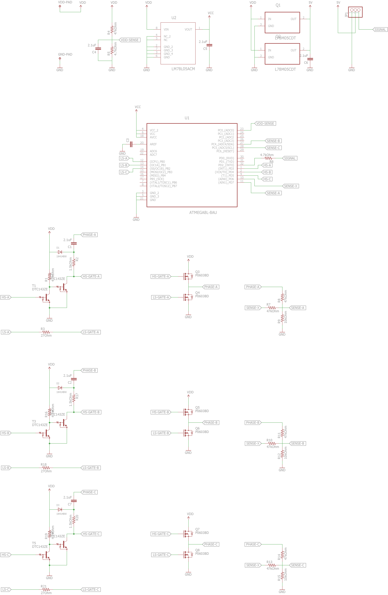

# XXD HW30A 30A ESC Schematic

This schematic is obtained by reverse-engineering from the fabricated PCB.

It was intended for modifying the firmware on the HW30A as a brushless motor controller for a gimbal/robotic arm.

Make sure this is the correct schematic you are looking for by referring to the attached PCB images below.

The schematic is only roughly verified. 

Please manually verify again. 

Feel free to open an issue/pull request if any mistake was found.

### Schematic

### Board images

.jpg)

.jpg)

